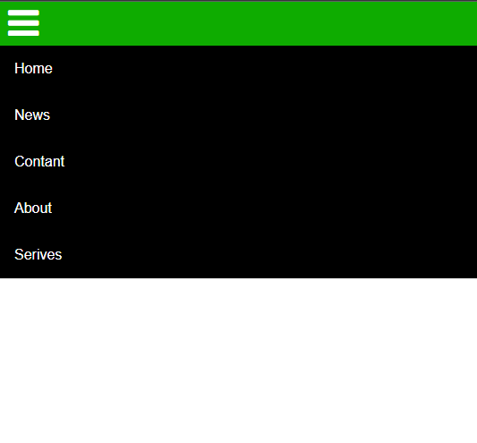

# simple-responsive-navbar
Simple Responsive Navbar

<h1>My Simple Responsive Navbar</h1>

I did something like this while continuing my education in the web field, I wanted to share it because it looks nice and useful.

What's inside is animated when the mouse is hovered over it.

Having a design that opens and closes when the screen width gets smaller (on mobile devices).

